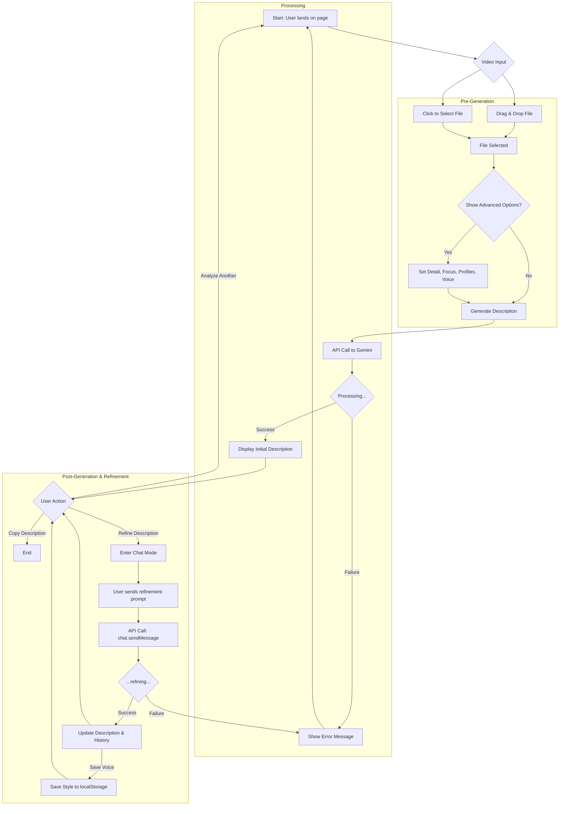

# Frontend Development Roadmap: Visual Video Describer

This document outlines the strategic plan for building the fully-featured frontend for the Visual Video Describer application, based on the established `requirements.md`. The implementation is divided into logical phases, building upon the existing MVP foundation.

## Guiding Principles

-   **Client-First:** All features in this roadmap will be implemented without a backend. Data persistence (profiles, voices) will be handled using the browser's `localStorage`.
-   **Progressive Disclosure:** Advanced features will be tucked away in a collapsible "Advanced Options" section to keep the primary user flow simple and clean.
-   **Component-Based Architecture:** Features will be built as modular React components for maintainability and reusability.
-   **State-Driven UI:** The application's view will be a direct reflection of its current state (`idle`, `processing`, `success`, `chatting`, etc.), ensuring predictable behavior.

---

## Phase 1: Core MVP (Foundation Complete)

This phase is already implemented and serves as the base for all future development.

**Status:** ✅ Complete

**Key Components & Logic:**
-   **Video Uploader:** Drag-and-drop and file-select functionality.
-   **File Validation:** Checks for video format and size constraints.
-   **State Machine:** Manages `idle`, `file-selected`, `processing`, `success`, and `error` states.
-   **Gemini Service:** A basic service to handle the one-off `generateContent` API call.
-   **Results Display:** Renders the generated description with a "Copy to Clipboard" feature.

---

## Phase 2: Advanced Pre-Generation Customization

This phase focuses on empowering the user to guide the AI *before* generating the initial description.

**Status:** ✅ Complete

This phase has been implemented, introducing a collapsible "Advanced Options" section. Users can now create and manage persistent "Person Profiles" using localStorage, select a "Detail Level" for the description, and provide a "Video Focus" to guide the AI, enabling a more customized and accurate output.

### Task 2.1: UI for "Advanced Options"
-   **Action:** Create a collapsible container component (`<AdvancedOptions />`).
-   **Behavior:** It should be closed by default and smoothly expand/collapse on user click. This component will house all the controls from Phase 2.

### Task 2.2: "Person Profiles" Feature
-   **Logic:** Create a custom hook `useLocalStorage` to abstract the reading and writing of profiles.
-   **State:** A state variable `profiles` will hold an array of `{id, name, pronouns, description}` objects.
-   **Components:**
    -   `PersonProfileManager.tsx`: A modal or dedicated section to Create, Read, Update, and Delete profiles. Each profile will have a simple form.
    -   `ProfileSelector.tsx`: A multi-select checklist or dropdown within the `<AdvancedOptions />` component that lists saved profiles.
-   **Integration:** The main `handleGenerateDescription` function will be updated. If any profiles are selected, their details will be prepended to the Gemini prompt, instructing the AI to identify them.

### Task 2.3: "Detail Level" & "Video Focus"
-   **State:** Add `detailLevel` ('Brief', 'Average', 'Detailed') and `videoFocus` (string) to the main app state.
-   **Components:**
    -   `DetailSelector.tsx`: A simple radio button group or segmented control for choosing the detail level.
    -   `FocusInput.tsx`: A text input or a dropdown with predefined suggestions for the video's focus.
-   **Integration:** Update the prompt engineering logic to incorporate these choices, modifying the instructions sent to the AI accordingly.

---

## Phase 3: Post-Generation Refinement & Personalization

This phase introduces an iterative workflow, allowing users to refine the AI's output and save their stylistic preferences.

**Status:** ✅ Complete

This phase introduces a powerful post-generation workflow. After the initial description is created, users can now enter a chat interface to iteratively refine the text with follow-up prompts. The underlying API integration has been shifted to use Gemini's chat capabilities (`ai.chats.create`). Furthermore, users can capture a refined writing style by using the "Save Preferred Voice" feature. This feature analyzes the refinement conversation to generate and save a reusable style guide to `localStorage`, which can be selected from the "Advanced Options" to personalize future video descriptions from the start.

### Task 3.1: API Refactor for Chat
-   **Action:** Modify the Gemini integration to use `ai.chats.create()` when a description is first generated.
-   **State:** The application state will need to be extended to hold the `chat` instance and the `history` of the conversation.

### Task 3.2: Iterative Chat Interface
-   **State:** Introduce a new application status, `refining`.
-   **Component:** `ChatRefinement.tsx`:
    -   This component will appear below the initial generated description when the status is `success` or `refining`.
    -   It will contain a simple display for the message history and an input field with a "Send" button for follow-up prompts.
    -   It will show a loading indicator while waiting for the chat model's response.
-   **Integration:** The "Send" button will call `chat.sendMessage()` with the user's refinement prompt. The UI will update in real-time with the AI's response. The main description text area will be updated with the latest refined version.

### Task 3.3: Save "Preferred Voice"
-   **Logic:**
    -   After a user has refined a description via chat, a "Save Voice" button will appear.
    -   Clicking this will open a modal asking the user to name their preference (e.g., "Witty & Brief," "Formal Corporate").
    -   The "voice" will be stored in `localStorage` by having the AI generate a style guide based on the conversation history.
-   **Components:**
    -   `SaveVoiceModal.tsx`: The modal for naming and saving the voice.
    -   `VoiceSelector.tsx`: A dropdown in the `<AdvancedOptions />` section to apply a previously saved voice to a new video analysis.
-   **Integration:** When a saved voice is selected, its stored instructions will be used to configure the system prompt for the new Gemini request, ensuring a consistent and personalized output.

---

## Application Flowchart

This flowchart visualizes the complete user journey, from initial interaction to advanced refinement.

